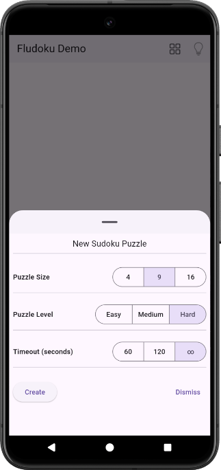
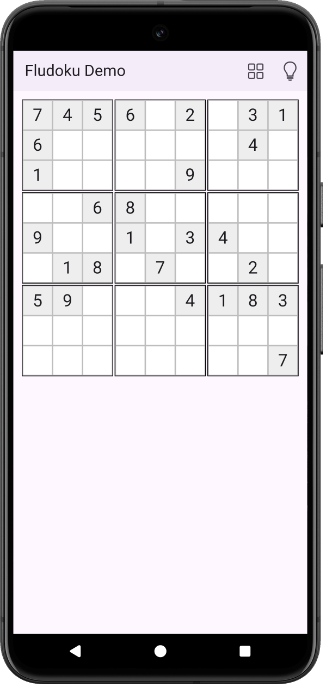

# fludoku_demo

A minimalistic demo Flutter application for the [Fludoku](https://pub.dev/packages/fludoku) package.

The demo allows creating Sudoku puzzles of dimensions `4`, `9`, and `16`, with difficulty degrees
ranging from `Easy` to `Hard`. It is also supports specifying the timeout for
puzzle generation to be `60` seconds, `120` seconds, or `infinite`.
  
Once a puzzle has been generated, it can be solved immediately by tapping the light
bulb icon at the top of the screen (screenshots below).

  

    
    

  

`fludoku_demo` demonstrates two important aspects for using Fludoku in a Flutter application that
may not be
immediately obvious:

- how the `Board` property `readOnlyPositions` retains the data about which positions are part of
  the puzzle definition (have non-zero values initially) and which ones are to be filled to solve
  the puzzle. The class that makes use of this property in the demo is `BoardWidget`;

- how to isolate (pum almost unavoidable :)) the puzzle generation into its own background
  cancellable task using a Dart `Isolate`. The very
  nice [easy-isolate](https://pub.dev/packages/easy_isolate) package is used to simplify the demo's
  implementation significantly.
